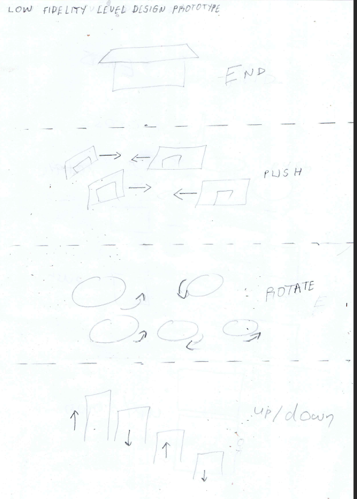

# ObstacleAssault 

Developed with Unreal Engine 5


### Modules are missing error fix

`That basically means you should rebuild as you likely updated Visual Studio or Unreal.  Use the rebuild build task from VS Code
<br>
Ctrl + Shift + B > ProjectNameEditor Platform Development Rebuild.
<br>
Where ProjectName is the name of your project and Platform is the platform you're targeting e.g. Win64
<br>
Or delete your project's Binaries and Intermediate folders then you'll be prompted to rebuild upon attempting to open the project.`

Using Structs in C++
=

`Constructor` - Makes a new struct or class value
<br>
A constructor in C++ is a special method that is automatically called when an object of a class is created.
<br>
To create a constructor, use the same name as the data type, followed by parentheses ()

```cpp
UPROPERTY(EditAnywhere)
FVector MyFloat = FVector(1,2,3); // Constructor
```

`Operators` - Symbols that do something
<br>
Operators are used to perform operations on variables and values.
<br>
e.g. `+,-.=.*,/`
<br>
`Dot Operator` - Gets something from within a struct or class
<br>
### Game Loop

1. Process Input
2. Update games state
3.  Render to display

- `Frame` - a single picture in a video
- `Frame rate` - how many frames per second(FPS)
- `Tick` - called every frame

### Scope

- How long does the variable live?
- Generally between {} braces

### Write Pseudocode with comments

- Pseudocode- plain language description of the steps in an algorithm.

### Functions

- Expression- fragment of code that produces a value

```cpp
MyVector
LocalVecor.Z + 100
GetActorLocation()
```

- Statement - an action to be performed

```cpp
FVector CurrentLocation = GetActorLocation();
```

### Using DeltaTime

- Using `DeltaTime` Unreal can tell us how long each frame took to execute
- When we multiply something by DeltaTime it makes our game "frame rate independent".
- ie the game behaves the same on fast and slow computers


Each second move 1 unit to the left

| | slow computer 🖥️ | fast computer 🖥️ |
|--|--------------|-------------|
|Frames per second| 10   | 100 |
|Duration of frame | 0.1s | 0.01s |
|Distance per second| 1 x 10 x 0.1 = 1| 1 x 100 x 0.01 = 1

- Scope Resolution Operator- (::) Looks inside a class

### [Vector normal](https://dev.to/fkkarakurt/matrices-and-vectors-in-game-development-67h)

A normal refers to a unit-length vector

- [GetSafeNormal](https://docs.unrealengine.com/4.26/en-US/API/Runtime/Core/Math/FVector/GetSafeNormal/)

```cpp
FVector GetSafeNormal
(
    float Tolerance
)  const
```

Gets a normalized copy of the vector, checking it is safe to do so based on the length. Returns zero vector of vectr length is too small to safely normalize.

[Game Mode and  Game State](https://docs.unrealengine.com/5.0/en-US/setting-up-a-game-mode-in-unreal-engine/)
=

- The GameMode defines the game's set of rules. The rules can include how players join the game, game pausing, and level transition, as well as any game-specific behavior such as win conditions. The GameMode is set for each level, and GameModes can be reused in multiple levels.

Output logs
=

- Using `Unreal Engine 4 Snippets`
    ```cpp
    ulog
    ```
- [Logging](https://docs.unrealengine.com/5.0/en-US/API/Runtime/Core/Logging/)
- [Logging](https://unrealcommunity.wiki/logging-lgpidy6i) means keeping an ordered record of events, function calls, variable values at certain time during runtime, etc. This is usually saved in the form of text in a log file.

- Syntax

```cpp
UE_LOG(LogTemp, Warning, TEXT("Hello"));
```

[FString](https://docs.unrealengine.com/4.26/en-US/ProgrammingAndScripting/ProgrammingWithCPP/UnrealArchitecture/StringHandling/FString/)
=

```cpp
//Creating FStrings
FString TestHUDString = FString(TEXT("This is my test FString."));
```

Conversions
-

| __From__ | __To__ | __Example__|
|-|-|-|
|Fstring| FNamae|TestHUDName = FName(*TestHUDString); <br> _FString -> FName is dangerous as the conversion is lossy as FName's are case insensitive._
|FString|FText|TestHUDText = FText::FromString(TestHUDString); <br> _FString -> FText is valid in some cases, but be aware that the FString's content will not benefit from the FText's "auto localization"._

[`Const` member function](https://www.geeksforgeeks.org/const-member-functions-c/#:~:text=Constant%20member%20functions%20are%20those,to%20the%20function%20definition%20header.)
=

`const values`
-

The [const keyword](https://learn.microsoft.com/en-us/cpp/cpp/const-cpp?redirectedfrom=MSDN&view=msvc-170) specifies that a variable's value is constant and tells the compiler to prevent the programmer from modifying it.

```cpp
// constant_values1.cpp
int main() {
   const int i = 5;
   i = 10;   // C3892
   i++;   // C2105
}
```

In C++, you can use the const keyword instead of the #define preprocessor directive to define constant values. Values defined with const are subject to type checking, and can be used in place of constant expressions. In C++, you can specify the size of an array with a const variable as follows:

```cpp
// constant_values2.cpp
// compile with: /c
const int maxarray = 255;
char store_char[maxarray];  // allowed in C++; not allowed in C
```

`const member functions`
-

Declaring a [member function](https://learn.microsoft.com/en-us/cpp/cpp/const-cpp?redirectedfrom=MSDN&view=msvc-170) with the const keyword specifies that the function is a "read-only" function that doesn't modify the object for which it's called. A constant member function can't modify any non-static data members or call any member functions that aren't constant. To declare a constant member function, place the const keyword after the closing parenthesis of the argument list. The const keyword is required in both the declaration and the definition.

```cpp
// constant_member_function.cpp
class Date
{
public:
   Date( int mn, int dy, int yr );
   int getMonth() const;     // A read-only function
   void setMonth( int mn );   // A write function; can't be const
private:
   int month;
};

int Date::getMonth() const
{
   return month;        // Doesn't modify anything
}
void Date::setMonth( int mn )
{
   month = mn;          // Modifies data member
}
int main()
{
   Date MyDate( 7, 4, 1998 );
   const Date BirthDate( 1, 18, 1953 );
   MyDate.setMonth( 4 );    // Okay
   BirthDate.getMonth();    // Okay
   BirthDate.setMonth( 4 ); // C2662 Error
}
```

- [Importance of const member functions](https://stackoverflow.com/questions/27573172/usefulness-of-const-member-function-method)

    Declaring a variable as `const` allows the compiler to perform a number of optimizations. It may be regarded as a strengthening of the strict aliasing rule. If two pointers are of the same type, ordinarily the compiler must assume they can alias. But if one is declared or used as const, the compiler may ignore potential aliasing with respect to those operations. This can reduce unnecessary loads and spills, leading to simpler, faster code.

    It's also important to make your code const-correct, so that it will interoperate properly with other code. Depending on the circumstances, casting away the const qualifier may invoke undefined behavior, so if a function is non-const, it will not be generally possible to use the function on a const object. This will cause problems for anyone who happens to have const objects.


FInalizing Level Design and Polish
=

- What elements can I play with?
    - Rotating/moving
    - up/down, left/right
    - pushing/transporting
- Simple linear course
- Get to the end

Level Design
-

<br>
